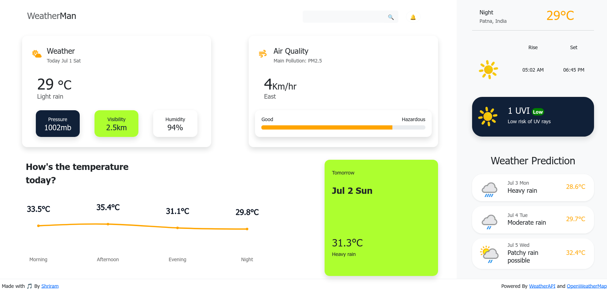

# WeatherMan

This is a simple weather dashboard built using React and powered by WeatherApi and OpenWeatherMap.



# Getting started with the project

* Clone the repository.
* Run `npm install` to install the necessary dependencies.
* create a `.env` file and add the API keys.
```
VITE_OWM_API=<OpenWeatherMap_API_KEY>
VITE_WA_API=<WeatherApi_API_KEY>
```
* Run `npm run dev` to start the development server.

# Contribution Guidelines

Love to have your contribution aboard, please follow the following guidelines to contribute:

* Fork the repository.
* Create a new branch for your changes.
* Make your changes and commit them.
* Open a pull request to the master branch.
* Add a detailed description about the changes.

# License
The project is under MIT License.

# Acknowledgements

* Real-time weather API [WeatherAPI](https://www.weatherapi.com/)
* Search/Autocomplete API [OpenWeatherMap](https://openweathermap.org/)
* UI inspired from [Budiarti](https://dribbble.com/shots/16833006-Weather-App-Dashboard-Design)

# Built with
[![React][React.js]][React-url]
[![Bootstrap][Bootstrap.com]][Bootstrap-url]
[![vercel][vercel.com]][vercel-url]


[React.js]: https://img.shields.io/badge/React-20232A?style=for-the-badge&logo=react&logoColor=61DAFB
[React-url]: https://reactjs.org/

[Bootstrap.com]: https://img.shields.io/badge/Bootstrap-563D7C?style=for-the-badge&logo=bootstrap&logoColor=white
[Bootstrap-url]: https://getbootstrap.com

[Vercel.com]: https://img.shields.io/badge/Vercel-000000?style=for-the-badge&logo=vercel&logoColor=white
[vercel-url]: https://vercel.com